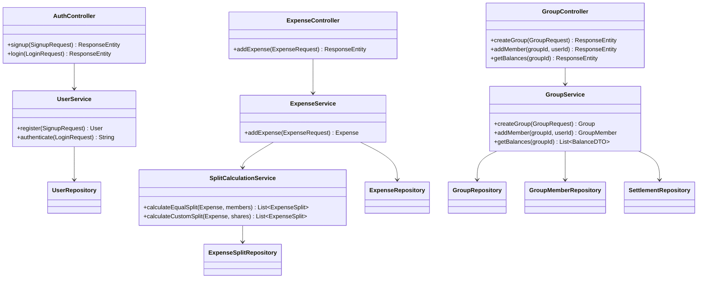

# Class / Module Diagram

**Notes**
- Controllers stay thin — no business logic, only request/response handling.
- `SplitCalculationService` is isolated from `ExpenseService` because it's the highest-risk logic (rounding, data integrity) and should be independently unit tested.
